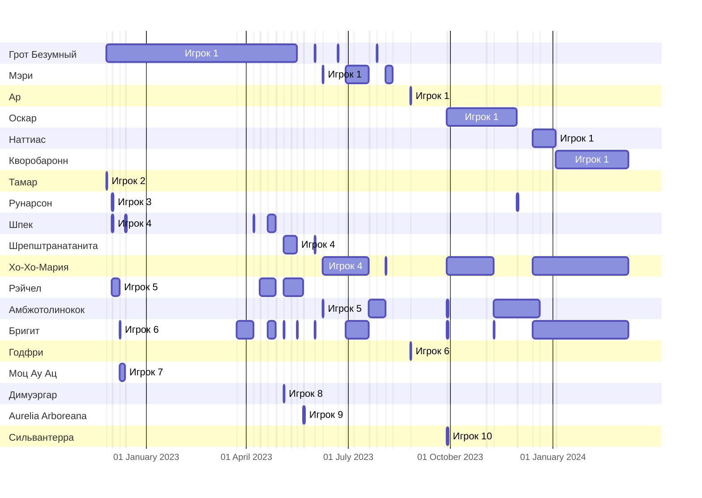

---
{"campaign":"GG Dungeon","dg-publish":true,"dg-permalink":"gg-dungeon-journal","aliases":["Дневник ГГ Данжен"],"permalink":"/gg-dungeon-journal/","dgPassFrontmatter":true}
---

## Список по датам
  | File                                      | играют                                                                                                                                                                                        |
| ----------------------------------------- | --------------------------------------------------------------------------------------------------------------------------------------------------------------------------------------------- |
| [[11 сентября 2024\|11 сентября 2024]] | <ul><li>[[Бригит\\|Бригит]]</li><li>[[Амбжотолинокок\\|Амбжотолинокок]]</li><li>[[Наттиас\\|Наттиас]]</li><li>[[Хо-Хо-Мария\\|Хо-Хо-Мария]]</li></ul>                                         |
| [[5 сентября 2024\|5 сентября 2024]]   | <ul><li>[[Наттиас\\|Наттиас]]</li><li>[[Амбжотолинокок\\|Амбжотолинокок]]</li><li>[[Хо-Хо-Мария\\|Хо-Хо-Мария]]</li><li>[[Бригит\\|Бригит]]</li></ul>                                         |
| [[29 августа 2024\|29 августа 2024]]   | <ul><li>[[Наттиас\\|Наттиас]]</li><li>[[Амбжотолинокок\\|Амбжотолинокок]]</li><li>[[Рунарсон\\|Рунарсон]]</li><li>[[Хо-Хо-Мария\\|Хо-Хо-Мария]]</li><li>[[Бригит\\|Бригит]]</li></ul>         |
| [[15 августа 2024\|15 августа 2024]]   | <ul><li>[[Хо-Хо-Мария\\|Хо-Хо-Мария]]</li><li>[[Амбжотолинокок\\|Амбжотолинокок]]</li><li>[[Рунарсон\\|Рунарсон]]</li><li>[[Наттиас\\|Наттиас]]</li></ul>                                     |
| [[25 июля 2024\|25 июля 2024]]         | <ul><li>[[Амбжотолинокок\\|Амбжотолинокок]]</li><li>[[Наттиас\\|Наттиас]]</li><li>[[Рунарсон\\|Рунарсон]]</li></ul>                                                                           |
| [[18 июля 2024\|18 июля 2024]]         | <ul><li>[[Хо-Хо-Мария\\|Хо-Хо-Мария]]</li><li>[[Наттиас\\|Наттиас]]</li></ul>                                                                                                                 |
| [[27 июня 2024\|27 июня 2024]]         | <ul><li>[[Бригит\\|Бригит]]</li><li>[[Хо-Хо-Мария\\|Хо-Хо-Мария]]</li><li>[[Наттиас\\|Наттиас]]</li><li>[[Рунарсон\\|Рунарсон]]</li><li>[[Амбжотолинокок\\|Амбжотолинокок]]</li></ul>         |
| [[30 мая 2024\|30 мая 2024]]           | <ul><li>[[Наттиас\\|Наттиас]]</li><li>[[Амбжотолинокок\\|Амбжотолинокок]]</li><li>[[Хо-Хо-Мария\\|Хо-Хо-Мария]]</li></ul>                                                                     |
| [[23 мая 2024\|23 мая 2024]]           | <ul><li>[[Амбжотолинокок\\|Амбжотолинокок]]</li><li>[[Наттиас\\|Наттиас]]</li><li>[[Рунарсон\\|Рунарсон]]</li></ul>                                                                           |
| [[9 мая 2024\|9 мая 2024]]             | <ul><li>[[Наттиас\\|Наттиас]]</li><li>[[Рунарсон\\|Рунарсон]]</li><li>[[Хо-Хо-Мария\\|Хо-Хо-Мария]]</li></ul>                                                                                 |
| [[2 мая 2024\|2 мая 2024]]             | <ul><li>[[Хо-Хо-Мария\\|Хо-Хо-Мария]]</li><li>[[Бригит\\|Бригит]]</li><li>[[Амбжотолинокок\\|Амбжотолинокок]]</li><li>[[Наттиас\\|Наттиас]]</li></ul>                                         |
| [[25 апреля 2024\|25 апреля 2024]]     | <ul><li>[[Хо-Хо-Мария\\|Хо-Хо-Мария]]</li><li>[[Наттиас\\|Наттиас]]</li><li>[[Рунарсон\\|Рунарсон]]</li></ul>                                                                                 |
| [[9 марта 2024\|9 марта 2024]]         | <ul><li>[[Бригит\\|Бригит]]</li><li>[[Хо-Хо-Мария\\|Хо-Хо-Мария]]</li><li>[[Кворобаронн\\|Кворобаронн]]</li><li>[[Амбжотолинокок\\|Амбжотолинокок]]</li></ul>                                 |
| [[4 января 2024\|4 января 2024]]       | <ul><li>[[Бригит\\|Бригит]]</li><li>[[Хо-Хо-Мария\\|Хо-Хо-Мария]]</li><li>[[Наттиас\\|Наттиас]]</li><li>[[Кворобаронн\\|Кворобаронн]]</li></ul>                                               |
| [[20 декабря 2023\|20 декабря 2023]]   | <ul><li>[[Наттиас\\|Наттиас]]</li><li>[[Хо-Хо-Мария\\|Хо-Хо-Мария]]</li><li>[[Бригит\\|Бригит]]</li><li>[[Амбжотолинокок\\|Амбжотолинокок]]</li></ul>                                         |
| [[14 декабря 2023\|14 декабря 2023]]   | <ul><li>[[Амбжотолинокок\\|Амбжотолинокок]]</li><li>[[Наттиас\\|Наттиас]]</li><li>[[Бригит\\|Бригит]]</li><li>[[Хо-Хо-Мария\\|Хо-Хо-Мария]]</li></ul>                                         |
| [[30 ноября 2023\|30 ноября 2023]]     | <ul><li>[[Амбжотолинокок\\|Амбжотолинокок]]</li><li>[[Оскар\\|Оскар]]</li><li>[[Рунарсон\\|Рунарсон]]</li></ul>                                                                               |
| [[9 ноября 2023\|9 ноября 2023]]       | <ul><li>[[Оскар\\|Оскар]]</li><li>[[Хо-Хо-Мария\\|Хо-Хо-Мария]]</li><li>[[Амбжотолинокок\\|Амбжотолинокок]]</li><li>[[Бригит\\|Бригит]]</li></ul>                                             |
| [[2 ноября 2023\|2 ноября 2023]]       | <ul><li>[[Оскар\\|Оскар]]</li><li>[[Хо-Хо-Мария\\|Хо-Хо-Мария]]</li></ul>                                                                                                                     |
| [[28 сентября 2023\|28 сентября 2023]] | <ul><li>[[Амбжотолинокок\\|Амбжотолинокок]]</li><li>[[Хо-Хо-Мария\\|Хо-Хо-Мария]]</li><li>[[Оскар\\|Оскар]]</li><li>[[Бригит\\|Бригит]]</li><li>[[Сильвантерра\\|Сильвантерра]]</li></ul>     |
| [[26 августа 2023\|26 августа 2023]]   | <ul><li>[[Годфри\\|Годфри]]</li><li>[[Ар\\|Ар]]</li></ul>                                                                                                                                     |
| [[10 августа 2023\|10 августа 2023]]   | <ul><li>[[Мэри\\|Мэри]]</li></ul>                                                                                                                                                             |
| [[4 августа 2023\|4 августа 2023]]     | <ul><li>[[Мэри\\|Мэри]]</li><li>[[Хо-Хо-Мария\\|Хо-Хо-Мария]]</li><li>[[Амбжотолинокок\\|Амбжотолинокок]]</li></ul>                                                                           |
| [[27 июля 2023\|27 июля 2023]]         | <ul><li>[[Амбжотолинокок\\|Амбжотолинокок]]</li><li>[[Грот Безумный\\|Грот Безумный]]</li></ul>                                                                                               |
| [[20 июля 2023\|20 июля 2023]]         | <ul><li>[[Бригит\\|Бригит]]</li><li>[[Мэри\\|Мэри]]</li><li>[[Хо-Хо-Мария\\|Хо-Хо-Мария]]</li><li>[[Амбжотолинокок\\|Амбжотолинокок]]</li></ul>                                               |
| [[6 июля 2023\|6 июля 2023]]           | <ul><li>[[Бригит\\|Бригит]]</li><li>[[Хо-Хо-Мария\\|Хо-Хо-Мария]]</li><li>[[Мэри\\|Мэри]]</li></ul>                                                                                           |
| [[29 июня 2023\|29 июня 2023]]         | <ul><li>[[Мэри\\|Мэри]]</li><li>[[Бригит\\|Бригит]]</li><li>[[Хо-Хо-Мария\\|Хо-Хо-Мария]]</li></ul>                                                                                           |
| [[22 июня 2023\|22 июня 2023]]         | <ul><li>[[Грот Безумный\\|Грот Безумный]]</li><li>[[Хо-Хо-Мария\\|Хо-Хо-Мария]]</li></ul>                                                                                                     |
| [[8 июня 2023\|8 июня 2023]]           | <ul><li>[[Амбжотолинокок\\|Амбжотолинокок]]</li><li>[[Хо-Хо-Мария\\|Хо-Хо-Мария]]</li><li>[[Мэри\\|Мэри]]</li></ul>                                                                           |
| [[1 июня 2023\|1 июня 2023]]           | <ul><li>[[Бригит\\|Бригит]]</li><li>[[Грот Безумный\\|Грот Безумный]]</li><li>[[Шрепштранатанита\\|Шрепштранатанита]]</li></ul>                                                               |
| [[22 мая 2023\|22 мая 2023]]           | <ul><li>[[Рэйчел\\|Рэйчел]]</li><li>[[Aurelia Arboreana\\|Aurelia Arboreana]]</li></ul>                                                                                                       |
| [[16 мая 2023\|16 мая 2023]]           | <ul><li>[[Рэйчел\\|Рэйчел]]</li><li>[[Бригит\\|Бригит]]</li><li>[[Грот Безумный\\|Грот Безумный]]</li><li>[[Шрепштранатанита\\|Шрепштранатанита]]</li></ul>                                   |
| [[11 мая 2023\|11 мая 2023]]           | <ul><li>[[Рэйчел\\|Рэйчел]]</li><li>[[Грот Безумный\\|Грот Безумный]]</li><li>[[Шрепштранатанита\\|Шрепштранатанита]]</li></ul>                                                               |
| [[4 мая 2023\|4 мая 2023]]             | <ul><li>[[Димуэргар\\|Димуэргар]]</li><li>[[Рэйчел\\|Рэйчел]]</li><li>[[Бригит\\|Бригит]]</li><li>[[Грот Безумный\\|Грот Безумный]]</li><li>[[Шрепштранатанита\\|Шрепштранатанита]]</li></ul> |
| [[28 апреля 2023\|28 апреля 2023]]     | <ul><li>[[Грот Безумный\\|Грот Безумный]]</li></ul>                                                                                                                                           |
| [[27 апреля 2023\|27 апреля 2023]]     | <ul><li>[[Грот Безумный\\|Грот Безумный]]</li><li>[[Бригит\\|Бригит]]</li><li>[[Шпек\\|Шпек]]</li><li>[[Рэйчел\\|Рэйчел]]</li></ul>                                                           |
| [[20 апреля 2023\|20 апреля 2023]]     | <ul><li>[[Грот Безумный\\|Грот Безумный]]</li><li>[[Рэйчел\\|Рэйчел]]</li><li>[[Шпек\\|Шпек]]</li><li>[[Бригит\\|Бригит]]</li></ul>                                                           |
| [[13 апреля 2023\|13 апреля 2023]]     | <ul><li>[[Рэйчел\\|Рэйчел]]</li><li>[[Грот Безумный\\|Грот Безумный]]</li></ul>                                                                                                               |
| [[7 апреля 2023\|7 апреля 2023]]       | <ul><li>[[Бригит\\|Бригит]]</li><li>[[Шпек\\|Шпек]]</li><li>[[Грот Безумный\\|Грот Безумный]]</li></ul>                                                                                       |
| [[23 марта 2023\|23 марта 2023]]       | <ul><li>[[Бригит\\|Бригит]]</li><li>[[Грот Безумный\\|Грот Безумный]]</li></ul>                                                                                                               |
| [[13 декабря 2022\|13 декабря 2022]]   | <ul><li>[[Грот Безумный\\|Грот Безумный]]</li><li>[[Моц Ау Ац\\|Моц Ау Ац]]</li><li>[[Шпек\\|Шпек]]</li></ul>                                                                                 |
| [[8 декабря 2022\|8 декабря 2022]]     | <ul><li>[[Грот Безумный\\|Грот Безумный]]</li><li>[[Бригит\\|Бригит]]</li><li>[[Моц Ау Ац\\|Моц Ау Ац]]</li><li>[[Рэйчел\\|Рэйчел]]</li></ul>                                                 |
| [[1 декабря 2022\|1 декабря 2022]]     | <ul><li>[[Грот Безумный\\|Грот Безумный]]</li><li>[[Рунарсон\\|Рунарсон]]</li><li>[[Шпек\\|Шпек]]</li><li>[[Рэйчел\\|Рэйчел]]</li></ul>                                                       |
| [[26 ноября 2022\|26 ноября 2022]]     | <ul><li>[[Грот Безумный\\|Грот Безумный]]</li><li>[[Тамар\\|Тамар]]</li></ul>                                                                                                                 |

{ .block-language-dataview}
## Активность по персонажам

