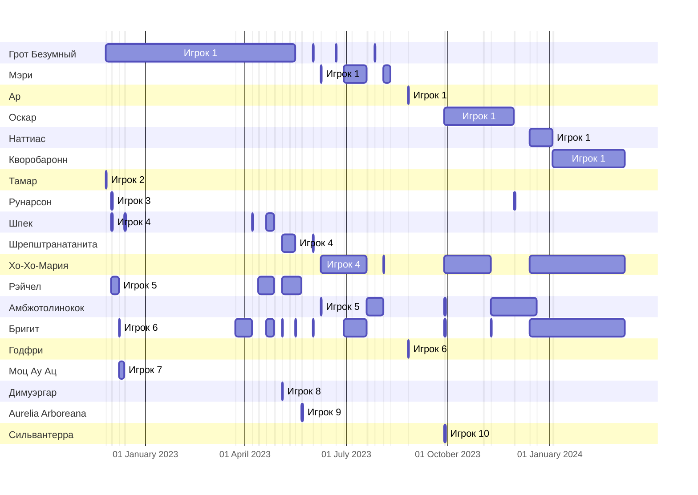

---
{"campaign":"GG Dungeon","dg-publish":true,"dg-permalink":"gg-dungeon-journal","aliases":["Дневник ГГ Данжен"],"permalink":"/gg-dungeon-journal/","dgPassFrontmatter":true}
---

## Список по датам
  | File                                      | играют                                                                                                                                                                                        |
| ----------------------------------------- | --------------------------------------------------------------------------------------------------------------------------------------------------------------------------------------------- |
| [[11 сентября 2024\|11 сентября 2024]] | <ul><li>[[Бригит\\|Бригит]]</li><li>[[Амбжотолинокок\\|Амбжотолинокок]]</li><li>[[Наттиас\\|Наттиас]]</li><li>[[Хо-Хо-Мария\\|Хо-Хо-Мария]]</li></ul>                                         |
| [[5 сентября 2024\|5 сентября 2024]]   | <ul><li>[[Наттиас\\|Наттиас]]</li><li>[[Амбжотолинокок\\|Амбжотолинокок]]</li><li>[[Хо-Хо-Мария\\|Хо-Хо-Мария]]</li><li>[[Бригит\\|Бригит]]</li></ul>                                         |
| [[29 августа 2024\|29 августа 2024]]   | <ul><li>[[Наттиас\\|Наттиас]]</li><li>[[Амбжотолинокок\\|Амбжотолинокок]]</li><li>[[Рунарсон\\|Рунарсон]]</li><li>[[Хо-Хо-Мария\\|Хо-Хо-Мария]]</li><li>[[Бригит\\|Бригит]]</li></ul>         |
| [[15 августа 2024\|15 августа 2024]]   | <ul><li>[[Хо-Хо-Мария\\|Хо-Хо-Мария]]</li><li>[[Амбжотолинокок\\|Амбжотолинокок]]</li><li>[[Рунарсон\\|Рунарсон]]</li><li>[[Наттиас\\|Наттиас]]</li></ul>                                     |
| [[25 июля 2024\|25 июля 2024]]         | <ul><li>[[Амбжотолинокок\\|Амбжотолинокок]]</li><li>[[Наттиас\\|Наттиас]]</li><li>[[Рунарсон\\|Рунарсон]]</li></ul>                                                                           |
| [[18 июля 2024\|18 июля 2024]]         | <ul><li>[[Хо-Хо-Мария\\|Хо-Хо-Мария]]</li><li>[[Наттиас\\|Наттиас]]</li></ul>                                                                                                                 |
| [[27 июня 2024\|27 июня 2024]]         | <ul><li>[[Бригит\\|Бригит]]</li><li>[[Хо-Хо-Мария\\|Хо-Хо-Мария]]</li><li>[[Наттиас\\|Наттиас]]</li><li>[[Рунарсон\\|Рунарсон]]</li><li>[[Амбжотолинокок\\|Амбжотолинокок]]</li></ul>         |
| [[30 мая 2024\|30 мая 2024]]           | <ul><li>[[Наттиас\\|Наттиас]]</li><li>[[Амбжотолинокок\\|Амбжотолинокок]]</li><li>[[Хо-Хо-Мария\\|Хо-Хо-Мария]]</li></ul>                                                                     |
| [[23 мая 2024\|23 мая 2024]]           | <ul><li>[[Амбжотолинокок\\|Амбжотолинокок]]</li><li>[[Наттиас\\|Наттиас]]</li><li>[[Рунарсон\\|Рунарсон]]</li></ul>                                                                           |
| [[9 мая 2024\|9 мая 2024]]             | <ul><li>[[Наттиас\\|Наттиас]]</li><li>[[Рунарсон\\|Рунарсон]]</li><li>[[Хо-Хо-Мария\\|Хо-Хо-Мария]]</li></ul>                                                                                 |
| [[2 мая 2024\|2 мая 2024]]             | <ul><li>[[Хо-Хо-Мария\\|Хо-Хо-Мария]]</li><li>[[Бригит\\|Бригит]]</li><li>[[Амбжотолинокок\\|Амбжотолинокок]]</li><li>[[Наттиас\\|Наттиас]]</li></ul>                                         |
| [[25 апреля 2024\|25 апреля 2024]]     | <ul><li>[[Хо-Хо-Мария\\|Хо-Хо-Мария]]</li><li>[[Наттиас\\|Наттиас]]</li><li>[[Рунарсон\\|Рунарсон]]</li></ul>                                                                                 |
| [[9 марта 2024\|9 марта 2024]]         | <ul><li>[[Бригит\\|Бригит]]</li><li>[[Хо-Хо-Мария\\|Хо-Хо-Мария]]</li><li>[[Кворобаронн\\|Кворобаронн]]</li><li>[[Амбжотолинокок\\|Амбжотолинокок]]</li></ul>                                 |
| [[4 января 2024\|4 января 2024]]       | <ul><li>[[Бригит\\|Бригит]]</li><li>[[Хо-Хо-Мария\\|Хо-Хо-Мария]]</li><li>[[Наттиас\\|Наттиас]]</li><li>[[Кворобаронн\\|Кворобаронн]]</li></ul>                                               |
| [[20 декабря 2023\|20 декабря 2023]]   | <ul><li>[[Наттиас\\|Наттиас]]</li><li>[[Хо-Хо-Мария\\|Хо-Хо-Мария]]</li><li>[[Бригит\\|Бригит]]</li><li>[[Амбжотолинокок\\|Амбжотолинокок]]</li></ul>                                         |
| [[14 декабря 2023\|14 декабря 2023]]   | <ul><li>[[Амбжотолинокок\\|Амбжотолинокок]]</li><li>[[Наттиас\\|Наттиас]]</li><li>[[Бригит\\|Бригит]]</li><li>[[Хо-Хо-Мария\\|Хо-Хо-Мария]]</li></ul>                                         |
| [[30 ноября 2023\|30 ноября 2023]]     | <ul><li>[[Амбжотолинокок\\|Амбжотолинокок]]</li><li>[[Оскар\\|Оскар]]</li><li>[[Рунарсон\\|Рунарсон]]</li></ul>                                                                               |
| [[9 ноября 2023\|9 ноября 2023]]       | <ul><li>[[Оскар\\|Оскар]]</li><li>[[Хо-Хо-Мария\\|Хо-Хо-Мария]]</li><li>[[Амбжотолинокок\\|Амбжотолинокок]]</li><li>[[Бригит\\|Бригит]]</li></ul>                                             |
| [[2 ноября 2023\|2 ноября 2023]]       | <ul><li>[[Оскар\\|Оскар]]</li><li>[[Хо-Хо-Мария\\|Хо-Хо-Мария]]</li></ul>                                                                                                                     |
| [[28 сентября 2023\|28 сентября 2023]] | <ul><li>[[Амбжотолинокок\\|Амбжотолинокок]]</li><li>[[Хо-Хо-Мария\\|Хо-Хо-Мария]]</li><li>[[Оскар\\|Оскар]]</li><li>[[Бригит\\|Бригит]]</li><li>[[Сильвантерра\\|Сильвантерра]]</li></ul>     |
| [[26 августа 2023\|26 августа 2023]]   | <ul><li>[[Годфри\\|Годфри]]</li><li>[[Ар\\|Ар]]</li></ul>                                                                                                                                     |
| [[10 августа 2023\|10 августа 2023]]   | <ul><li>[[Мэри\\|Мэри]]</li></ul>                                                                                                                                                             |
| [[4 августа 2023\|4 августа 2023]]     | <ul><li>[[Мэри\\|Мэри]]</li><li>[[Хо-Хо-Мария\\|Хо-Хо-Мария]]</li><li>[[Амбжотолинокок\\|Амбжотолинокок]]</li></ul>                                                                           |
| [[27 июля 2023\|27 июля 2023]]         | <ul><li>[[Амбжотолинокок\\|Амбжотолинокок]]</li><li>[[Грот Безумный\\|Грот Безумный]]</li></ul>                                                                                               |
| [[20 июля 2023\|20 июля 2023]]         | <ul><li>[[Бригит\\|Бригит]]</li><li>[[Мэри\\|Мэри]]</li><li>[[Хо-Хо-Мария\\|Хо-Хо-Мария]]</li><li>[[Амбжотолинокок\\|Амбжотолинокок]]</li></ul>                                               |
| [[6 июля 2023\|6 июля 2023]]           | <ul><li>[[Бригит\\|Бригит]]</li><li>[[Хо-Хо-Мария\\|Хо-Хо-Мария]]</li><li>[[Мэри\\|Мэри]]</li></ul>                                                                                           |
| [[29 июня 2023\|29 июня 2023]]         | <ul><li>[[Мэри\\|Мэри]]</li><li>[[Бригит\\|Бригит]]</li><li>[[Хо-Хо-Мария\\|Хо-Хо-Мария]]</li></ul>                                                                                           |
| [[22 июня 2023\|22 июня 2023]]         | <ul><li>[[Грот Безумный\\|Грот Безумный]]</li><li>[[Хо-Хо-Мария\\|Хо-Хо-Мария]]</li></ul>                                                                                                     |
| [[8 июня 2023\|8 июня 2023]]           | <ul><li>[[Амбжотолинокок\\|Амбжотолинокок]]</li><li>[[Хо-Хо-Мария\\|Хо-Хо-Мария]]</li><li>[[Мэри\\|Мэри]]</li></ul>                                                                           |
| [[1 июня 2023\|1 июня 2023]]           | <ul><li>[[Бригит\\|Бригит]]</li><li>[[Грот Безумный\\|Грот Безумный]]</li><li>[[Шрепштранатанита\\|Шрепштранатанита]]</li></ul>                                                               |
| [[22 мая 2023\|22 мая 2023]]           | <ul><li>[[Рэйчел\\|Рэйчел]]</li><li>[[Aurelia Arboreana\\|Aurelia Arboreana]]</li></ul>                                                                                                       |
| [[16 мая 2023\|16 мая 2023]]           | <ul><li>[[Рэйчел\\|Рэйчел]]</li><li>[[Бригит\\|Бригит]]</li><li>[[Грот Безумный\\|Грот Безумный]]</li><li>[[Шрепштранатанита\\|Шрепштранатанита]]</li></ul>                                   |
| [[11 мая 2023\|11 мая 2023]]           | <ul><li>[[Рэйчел\\|Рэйчел]]</li><li>[[Грот Безумный\\|Грот Безумный]]</li><li>[[Шрепштранатанита\\|Шрепштранатанита]]</li></ul>                                                               |
| [[4 мая 2023\|4 мая 2023]]             | <ul><li>[[Димуэргар\\|Димуэргар]]</li><li>[[Рэйчел\\|Рэйчел]]</li><li>[[Бригит\\|Бригит]]</li><li>[[Грот Безумный\\|Грот Безумный]]</li><li>[[Шрепштранатанита\\|Шрепштранатанита]]</li></ul> |
| [[28 апреля 2023\|28 апреля 2023]]     | <ul><li>[[Грот Безумный\\|Грот Безумный]]</li></ul>                                                                                                                                           |
| [[27 апреля 2023\|27 апреля 2023]]     | <ul><li>[[Грот Безумный\\|Грот Безумный]]</li><li>[[Бригит\\|Бригит]]</li><li>[[Шпек\\|Шпек]]</li><li>[[Рэйчел\\|Рэйчел]]</li></ul>                                                           |
| [[20 апреля 2023\|20 апреля 2023]]     | <ul><li>[[Грот Безумный\\|Грот Безумный]]</li><li>[[Рэйчел\\|Рэйчел]]</li><li>[[Шпек\\|Шпек]]</li><li>[[Бригит\\|Бригит]]</li></ul>                                                           |
| [[13 апреля 2023\|13 апреля 2023]]     | <ul><li>[[Рэйчел\\|Рэйчел]]</li><li>[[Грот Безумный\\|Грот Безумный]]</li></ul>                                                                                                               |
| [[7 апреля 2023\|7 апреля 2023]]       | <ul><li>[[Бригит\\|Бригит]]</li><li>[[Шпек\\|Шпек]]</li><li>[[Грот Безумный\\|Грот Безумный]]</li></ul>                                                                                       |
| [[23 марта 2023\|23 марта 2023]]       | <ul><li>[[Бригит\\|Бригит]]</li><li>[[Грот Безумный\\|Грот Безумный]]</li></ul>                                                                                                               |
| [[13 декабря 2022\|13 декабря 2022]]   | <ul><li>[[Грот Безумный\\|Грот Безумный]]</li><li>[[Моц Ау Ац\\|Моц Ау Ац]]</li><li>[[Шпек\\|Шпек]]</li></ul>                                                                                 |
| [[8 декабря 2022\|8 декабря 2022]]     | <ul><li>[[Грот Безумный\\|Грот Безумный]]</li><li>[[Бригит\\|Бригит]]</li><li>[[Моц Ау Ац\\|Моц Ау Ац]]</li><li>[[Рэйчел\\|Рэйчел]]</li></ul>                                                 |
| [[1 декабря 2022\|1 декабря 2022]]     | <ul><li>[[Грот Безумный\\|Грот Безумный]]</li><li>[[Рунарсон\\|Рунарсон]]</li><li>[[Шпек\\|Шпек]]</li><li>[[Рэйчел\\|Рэйчел]]</li></ul>                                                       |
| [[26 ноября 2022\|26 ноября 2022]]     | <ul><li>[[Грот Безумный\\|Грот Безумный]]</li><li>[[Тамар\\|Тамар]]</li></ul>                                                                                                                 |

{ .block-language-dataview}
## Активность по персонажам

```mermaid
gantt
%%{ init: { "gantt": { "displayMode": "compact", "leftPadding": 120 } } }%%
	dateFormat YYYY-MM-DD
    axisFormat %d %B %Y
    tickInterval 3month
	excludes 2022-11-26, 2022-12-01, 2022-12-08, 2022-12-13, 2023-03-23,2023-04-07, 2023-04-13, 2023-04-20, 2023-04-27, 2023-04-28, 2023-05-04, 2023-05-11, 2023-05-16, 2023-05-22, 2023-06-01, 2023-06-08, 2023-06-22, 2023-06-29, 2023-07-06, 2023-07-20, 2023-07-27, 2023-08-04, 2023-08-10, 2023-08-26, 2023-09-28, 2023-11-02, 2023-11-09, 2023-11-30, 2023-12-14, 2023-12-20, 2024-03-09, 2024-01-04
	todayMarker off
	section Грот Безумный
		Игрок 1: 2022-11-26,2023-05-16
		᠎: 2023-06-01, 1d
		᠎: 2023-06-22, 1d
		᠎: 2023-07-27, 1d
	section Мэри
		Игрок 1: 2023-06-08, 1d
		᠎: 2023-06-29, 2023-07-20
		᠎: 2023-08-04, 2023-08-10
	section Ар
		Игрок 1: 2023-08-26, 1d 
	section Оскар
		Игрок 1: 2023-09-28, 2023-11-30
	section Наттиас
		Игрок 1: 2023-12-14, 2024-01-04
	section Кворобаронн
		Игрок 1: 2024-01-04, 2024-03-09
	section Тамар
		Игрок 2:2022-11-26, 1d
	section Рунарсон
		Игрок 3: 2022-12-01, 1d
		᠎: 2023-11-30, 1d
	section Шпек
		Игрок 4: 2022-12-01, 1d
		᠎: 2022-12-13, 1d
		᠎: 2023-04-07, 1d
		᠎: 2023-04-20, 2023-04-27
	section Шрепштранатанита
		Игрок 4: 2023-05-04, 2023-05-16
		᠎: 2023-06-01, 1d
	section Хо-Хо-Мария
		Игрок 4: 2023-06-08, 2023-07-20
		᠎: 2023-08-04, 1d
		᠎: 2023-09-28, 2023-11-09
		᠎: 2023-12-14, 2024-03-09
	section Рэйчел
		Игрок 5: 2022-12-01, 2022-12-08
		᠎: 2023-04-13, 2023-04-27
		᠎: 2023-05-04, 2023-05-22
	section Амбжотолинокок
		Игрок 5: 2023-06-08, 1d
		᠎: 2023-07-20, 2023-08-04
		᠎: 2023-09-28, 1d
		᠎: 2023-11-09, 2023-12-20
	section Бригит
		Игрок 6: 2022-12-08, 1d
		᠎: 2023-03-23, 2023-04-07
		᠎: 2023-04-20, 2023-04-27
		᠎: 2023-05-04, 1d
		᠎: 2023-05-16, 1d
		᠎: 2023-06-01, 1d 
		᠎: 2023-06-29, 2023-07-20
		᠎: 2023-09-28, 1d
		᠎: 2023-11-09, 1d
		᠎: 2023-12-14, 2024-03-09
	section Годфри
		Игрок 6: 2023-08-26, 1d 
	section Моц Ау Ац
		Игрок 7: 2022-12-08, 2022-12-13
	section Димуэргар
		Игрок 8: 2023-05-04, 1d
	section Aurelia Arboreana
		Игрок 9: 2023-05-22, 1d 
	section Сильвантерра
		Игрок 10: 2023-09-28, 1d
```

## Хронология GG Dungeon

> [!NOTE] нагенерено и не проверено

[[26 ноября 2022\|26 ноября 2022]]
Знакомство с [[Грот Безумный\|Гротом]] в таверне [[Орион\|Уилфреда]]. Спуск в подвал через канализацию, битва с желатиновым кубом и скелетом внутри него. Наём полуорка [[Код\|Кода]].

[[1 декабря 2022\|1 декабря 2022]]
Повторный спуск в подземелье таверны. Прохождение комнаты с говорящей головой-загадкой, битва с ржавым монстром-тараканом. Встреча с танцующим пауком-тарантеллой и его скелетом.

[[8 декабря 2022\|8 декабря 2022]]
Знакомство с друидом [[Бригит\|Бригит]] и паладином [[Моц Ау Ац\|Моц Ау Ац]]. Гибель Кода от кислотной слизи. Исследование новых коридоров, банкетный зал и статуи с оружием.

[[13 декабря 2022\|13 декабря 2022]]
Спуск по подземной реке на лодке через водопад. Битва с троллями и мимиком-сундуком. Исследование пещер со сталактитами и загадочной зелёной субстанцией.

[[23 марта 2023\|23 марта 2023]]
Поход в деревню [[Файербенд\|Файербенд]], где дети добывают масло из личинок жуков. Знакомство с подземным существом [[Неболтус\|Неболтусом]]. Гибель мальчика [[Глирол\|Глирола]] от тонкой иглы.

[[7 апреля 2023\|7 апреля 2023]]
Исследование таинственной башни на полуострове у озера. Встреча с гигантскими пеликанами, невидимым гоблином и загадочными цифрами. Находка магических артефактов среди мусора.

[[13 апреля 2023\|13 апреля 2023]]
Прибытие в [[Тур-дэ-Совы\|Тур-дэ-Совы]] и получение задания от [[Селарити Морган\|Селарити Морган]] шпионить за семьёй [[Малевол\|Малевол]]. Посещение [[Замок Ксантилан\|замка Ксантилан]]. Встреча со статуями слепой обезьяны, горбуна и короля, получение чёрной сферы.

[[20 апреля 2023\|20 апреля 2023]]
Продолжение исследования двора [[Замок Ксантилан\|замка]]. Разговор с жуками и воронами через магию, битва со скелетами и ожившим молотом в кузне. Спасение человека из запертого шкафа.

[[27 апреля 2023\|27 апреля 2023]]
Спуск в подземелья замка через люк во дворе. Битва с гулями, гибель [[Шпек\|Шпека]]. Встреча с безголовым слугой и ожившими портретами семьи [[Малевол\|Малевол]].

[[28 апреля 2023\|28 апреля 2023]]
Самостоятельный поход [[Грот Безумный\|Грота]] в поисках магического артефакта для починки портала в [[старые врата в фейвальд\|Фейвальд]]. Посещение деревни [[Гронэ\|Гронэ]] и разрушенного храма [[Иалдир\|Иалдира]]. Встреча с поющим радужным кабаном.

[[4 мая 2023\|4 мая 2023]]
Возвращение в замок с новыми членами партии. Битва с зомби и [[Гилс Малевол\|Гилсом Малеволом]]. [[Рэйчел\|Рэйчел]] получает квест от бога [[Азрос\|Азроса]] (Вепря).

[[11 мая 2023\|11 мая 2023]]
Проникновение в замок через подкуп скелетов-стражников. Встреча с призраком горничной и [[Леопольд Малевол\|Леопольдом Малеволом]]. Исчезновение [[Венделин\|Венделина]] со всеми вещами партии.

[[16 мая 2023\|16 мая 2023]]
Поиски волшебника [[Бен Мордешай\|Бена Мордешая]] и информации о замке. Поход к башне [[Селарити Морган\|Селарити Морган]], встреча с армией нежити. [[Грот Безумный\|Грот]] убивает [[Венделин\|Венделина]], ставшего нежитью.

[[22 мая 2023\|22 мая 2023]]
Смерть [[Рэйчел\|Рэйчел]] (проклятие кошки) и [[Aurelia Arboreana\|Aurelia Arboreana]] (погибла, успокаивая кота).

[[1 июня 2023\|1 июня 2023]]
[[Грот Безумный\|Грот]] пытается вступить в паладинов Иалдира. Спуск в дыру во дворе замка. Принцесса у статуи оказывается троллем и убивает [[Шрепштранатанита\|Щепку]].

[[8 июня 2023\|8 июня 2023]]
Новая группа персонажей исследует замок: посещение оракула [[Иалдир\|Иалдира]], битва со скелетами в башне и зомби-монахинями.

[[22 июня 2023\|22 июня 2023]]
[[Грот Безумный\|Грот]] внедряется в отряд паладинов, сопровождающих ценный артефакт. [[Хо-Хо-Мария\|Хо-Хо-Мария]] притворяется священником для освящения храма. Грот обнаруживает заговор и скрывается в катакомбах.

[[29 июня 2023\|29 июня 2023]]
Исследование подземелий замка. Встреча с тремя ведьмами, [[Сибель Малевол\|Сибель Малевол]] и принцем [[Лоуренс\|Лоуренсом]], превращённым в жабу. Спасение принца поцелуем. [[Мэри\|Мэри]] получает глаз на пятке.

[[6 июля 2023\|6 июля 2023]]
Получение [[Видящий кристалл\|Видящего кристалла]] и возвращение зрения слепой статуе. Встреча с призраком [[Клодетт Малевол\|Клодетт Малевол]], история о проклятии рода и [[Грааль\|Граале]]. Посещение библиотеки, битва с гарпиями.

[[20 июля 2023\|20 июля 2023]]
Встреча с волшебником [[Орион\|Орионом]] Старвивером и [[Клод Малевол\|Клодом Малеволом]]. [[Слепая Обезьяна\|Слепая Обезьяна]] оказывается проклятым оруженосцем [[Мидарт Малевол\|Мидарта]] и рассказывает песенку-подсказку о пяти предметах для доступа к [[Грааль\|Граалю]].

[[27 июля 2023\|27 июля 2023]]
Атака на башню с демоном в деревне [[Гронэ\|Гронэ]]. Уничтожение урны с сердцем, освобождение [[Великий демон\|Великого демона]], летящего уничтожать [[Тур-дэ-Совы\|Тур-дэ-Совы]]. [[Амбжотолинокок\|Амбжотолинокок]] получает магическое сердце эльфов.

[[4 августа 2023\|4 августа 2023]]
Город [[Тур-дэ-Совы\|Тур-дэ-Совы]] разрушен демонами. Торговля с демонизированным [[Паскаль\|Паскалем]] за [[Красные Монеты\|красные монеты]]. Встреча с кровавыми демонами и гибель [[Мэри\|Мэри]].

[[10 августа 2023\|10 августа 2023]]
[[Мэри\|Мэри]] в катакомбах под разрушенным городом, встреча с выжившими паладинами. Предательство и гибель Мэри от кровавого демона. Бегство остальных через городские стены.

[[26 августа 2023\|26 августа 2023]]
Новая партия ([[Годфри\|Годфри]] и [[Ар\|Ар]]) просыпается в плену у культистов. Исследование подземелий, загадки с тремя подношениями. Встреча с враждебным хоббитом и водяным существом.

[[28 сентября 2023\|28 сентября 2023]]
Возвращение в [[Замок Ксантилан\|Замок Ксантилан]]. [[Амбжотолинокок\|Амбжотолинокок]] получает доступ в [[старые врата в фейвальд\|фейский мир]]. Вальс с призраками в бальном зале. [[Оскар\|Оскар]] надевает броню палача.

[[2 ноября 2023\|2 ноября 2023]]
Исследование тюремных подземелий. Встреча с узниками, включая шута с ключом. Находка магических карманных часов, ускоряющих время. Получение рубинового амулета из могилы.

[[9 ноября 2023\|9 ноября 2023]]
Пожар в тюрьме, побег заключённых. Встреча с [[Сатир\|сатиром]] и тараканом [[Грегор Малевол\|Грегором Малеволом]]. Путь через пещеру к выходу в лес. Подсказка про [[Освященное Масло\|Освященное Масло]].

[[30 ноября 2023\|30 ноября 2023]]
Поиск в подземельях замка. Находка [[Освященное Масло\|освящённого масла]] в тайном саркофаге. Снятие проклятия с [[Амбжотолинокок\|Амбжотолинокока]]. Гибель [[Оскар\|Оскара]] от гулей.

[[14 декабря 2023\|14 декабря 2023]]
Битва с ожившими чучелами и трупом охотника в тронном зале. Получение [[The Reliquary of Bygone Kings\|Реликвии Погибших Королей]]. Сражение с антимагическим призраком-стражем.

[[20 декабря 2023\|20 декабря 2023]]
Исследование пустой могилы [[Тристан Малевол\|Тристана Малевола]]. Встреча с призраком [[Сибель Малевол\|Сибель Малевол]] и получение [[Посох Меравинга\|Посох Меравинга]], указывающего на [[Грааль\|Грааль]]. Знакомство с безумным алхимиком.

[[4 января 2024\|4 января 2024]]
Спуск в каплицу с саркофагами крестоносцев. Уничтожение призрака зельем экстирпации. Нападение гаргулий и козлокурок, окаменение [[Наттиас\|Наттиаса]].

[[9 марта 2024\|9 марта 2024]]
Возвращение к окаменевшему [[Наттиас\|Наттиасу]]. [[Бригит\|Бригит]] уменьшается от зелья. Встреча с красным туманом-кровью, гибель [[Кворобаронн\|Кворобаронна]]. Оживление Наттиаса через масло и благословение паучьей королевы.

[[25 апреля 2024\|25 апреля 2024]]
Исследование островной башни. Призрачный суд над [[Хо-Хо-Мария\|Хо-Хо-Марией]]. Встреча с черепом [[Боб\|Бобом]] с телекинезом. Битва с вампиром на верхнем этаже.

[[2 мая 2024\|2 мая 2024]]
Исследование восьми запутанных проходов под тронным залом. Встреча с отшельником-священником. Бутылка с крысой и таинственные монахини.

[[9 мая 2024\|9 мая 2024]]
Битва с летающими мечами и ожившими доспехами. Освобождение закованного [[Болеро\|Болеро]]. Очищение осквернённого алтаря [[Иалдир\|Иалдира]]. Получение [[Посох Глубоких Лесов\|Посох Глубоких Лесов]].

[[23 мая 2024\|23 мая 2024]]
Исследование новых комнат замка. Встреча с пиратом-капитаном, вдовой [[Морелла Малевол\|Мореллой Малевол]] и танцующей дамой из костей. Находка золотого питона.

[[30 мая 2024\|30 мая 2024]]
Путь к [[Грааль\|Граалю]] через усыпальницу крестоносцев. Получение Книги Мертвых и зелья воскрешения. [[Хо-Хо-Мария\|Хо-Хо-Мария]] жертвует собой, его кровь оскверняет фальшивый Грааль, но [[Освященное Масло\|Освященное Масло]] очищает кубок.

[[27 июня 2024\|27 июня 2024]]
[[Бригит\|Бригит]] посвящают в фейский круг, рассказывают о коррумпированном друиде [[Рунсиус\|Рунсиусе]]. [[Хо-Хо-Мария\|Хо-Хо-Мария]] получает ангела смерти для церкви. Битва с безголовым вампиром с помощью коня-андеда.

[[18 июля 2024\|18 июля 2024]]
Исследование второго этажа замка. Комната с жонглирующими ножами и двойниками. Призрак [[Беатрис\|Беатрис]] оплакивает [[Бартоломи Малевол\|Бартоломи Малевола]], призванного из Книги Мертвых.

[[25 июля 2024\|25 июля 2024]]
Поход через охотничьи угодья. Встреча с медведями-двойниками и графоманом [[Жан-Жак Малевол\|Жан-Жаком Малеволом]]. Театр для зомби. Находка бьющегося сердца, гибель и воскрешение [[Амбжотолинокок\|Амбжотолинокока]].

[[15 августа 2024\|15 августа 2024]]
Путь к мельнице. Исследование угодий с призраками аристократов и пряничным домом. Русалки и битва с белками-вампирами. Получение [[Кольцо Озраса\|Кольцо Озраса]].

[[29 августа 2024\|29 августа 2024]]
Поиски [[Грааль\|Грааля]] в угодьях. Получение Говорящего Меча-Кролика из пруда. Сражение с богомолами и культистами [[Ксертар\|Ксертара]]. Гнев Ксертара на [[Бригит\|Бригит]].

[[5 сентября 2024\|5 сентября 2024]]
Путь через каменный сад с ядовитым плющом и зомби-овцами. Встреча с пауками, получение серебряной паучьей рубашки. Освобождение фиолетового червя из желудя.

[[11 сентября 2024\|11 сентября 2024]]
Тоннель приводит группу обратно в разрушенный [[Тур-дэ-Совы\|Тур-дэ-Совы]] с башней из черепов. Встреча с аптекарем, служащим [[Мадам Полидори\|Мадам Полидори]]. Выяснение, что [[Сияющий Чемпион\|Сияющий Чемпион]] наступает, а город захвачен демонами.
